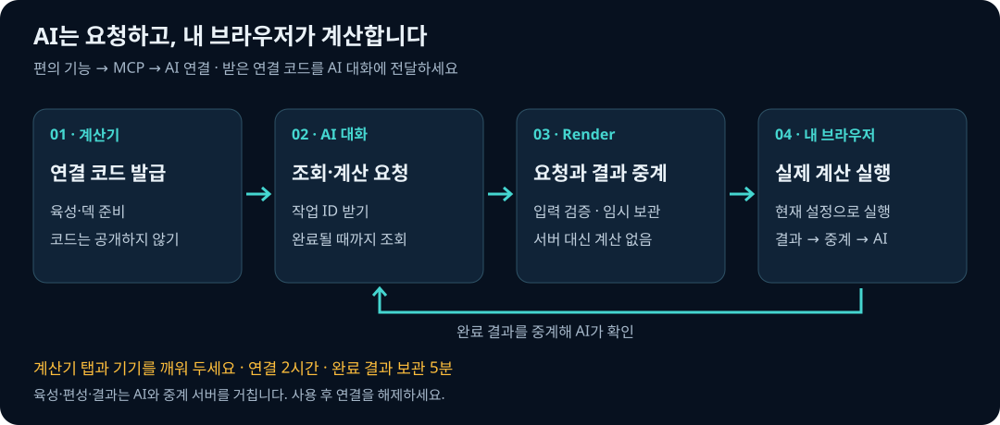

# AI에서 니케 계산기 사용하기

ChatGPT·Claude에서 계산을 요청하면 **열어 둔 계산기 브라우저가 Python 엔진을 실행**합니다.
공개 Render 서버는 요청과 결과를 중계합니다. 브라우저가 끊기면 서버가 대신 계산하지 않습니다.
AI 모델이나 OpenAI API 키를 계산기에 입력할 필요는 없습니다. AI 서비스의 이용 조건은 별도입니다.

**공개 MCP 주소:** `https://nikke-calc-mcp.onrender.com/mcp` · 인증 방식: **No Authentication**

[서버 상태 확인](https://nikke-calc-mcp.onrender.com/health)에서 `status: ok`를 확인한 뒤
ChatGPT는 **6절**, Claude 웹은 **7절**에 따라 등록합니다. 이어 **8절에서 브라우저를 연결**합니다.
GitHub Pages 사이트 주소는 MCP 주소가 아닙니다. Render 절전 후 첫 응답은 늦을 수 있습니다.

## 1. 연결 방식 고르기

| 사용 환경 | 연결 방식 | 계산 위치 |
|---|---|---|
| ChatGPT·Claude 웹의 원격 커넥터 | 공개 HTTPS MCP + 브라우저 연결 코드 | 열어 둔 계산기 탭 |
| Claude Desktop의 로컬 MCP·로컬 에이전트 | stdio | 이 PC의 Python |
| 개발 중 HTTP 점검 | `http://127.0.0.1:8000/mcp` | 연결한 개발용 계산기 브라우저 |

공개 주소를 사용하면 서버나 Python을 설치하지 않아도 됩니다. 로컬 stdio를 사용하려면 2~3절을 따르세요.
원격 커넥터는 AI 서비스의 서버에서 접속하므로 `localhost`만 입력해서 PC에 연결할 수는 없습니다.

## 2. Windows 설치

Python 3.10 이상과 Git이 필요합니다. PowerShell에서 실행합니다.
이미 저장소가 있으면 clone을 반복하지 말고 기존 저장소 폴더로 이동하세요.

```powershell
git clone https://github.com/Moris-kr/nikke-calc.git
cd nikke-calc
powershell -ExecutionPolicy Bypass -File .\nikke_mcp\setup.ps1
```

`Bypass`는 위 설치 프로세스에만 적용되며 시스템 실행 정책은 바꾸지 않습니다.
`python` 명령이 없다면 설치된 Python의 경로를 지정할 수 있습니다.

```powershell
.\nikke_mcp\setup.ps1 -Python 'C:\Python312\python.exe'
```

설치기는 저장소 안에 `.venv-mcp` 가상환경을 만들고, 필요한 라이브러리와
**이 PC의 경로가 들어간 Claude 설정 예제**를 생성합니다. 기존 앱 설정은 수정하지 않습니다.
마지막에 `"status": "OK"`와 아래 도구 이름이 나오면 실제 연결·계산 검증까지 성공한 것입니다.

```text
list_characters · get_character · get_settings · simulate_squad · compare_setups
inspect_shared_state · simulate_shared_state
```

직접 다시 확인하려면:

```powershell
.\.venv-mcp\Scripts\python.exe .\nikke_mcp\smoke.py
```

macOS/Linux에서는 같은 저장소에서 다음 명령을 사용합니다.

```bash
python3 -m venv .venv-mcp
.venv-mcp/bin/python -m pip install -r nikke_mcp/requirements.txt
.venv-mcp/bin/python nikke_mcp/smoke.py
```

## 3. Claude Desktop / 로컬 에이전트 연결

Claude Desktop의 설정에서 개발자(Developer) → 설정 편집(Edit Config)을 엽니다.
메뉴 이름은 앱 버전에 따라 다를 수 있습니다. 로컬 MCP 설정 파일은
Windows의 `%APPDATA%\Claude\claude_desktop_config.json`입니다.

설치기가 만든 `.venv-mcp/claude-desktop-config.json` 내용을 확인한 뒤,
기존 파일의 `mcpServers` 안에 **`nikke-calc` 항목만 병합**합니다. 다른 서버 설정을 덮어쓰지 마세요.
아래 경로는 예시이며 실제 설치 위치로 바꿔야 합니다.

```json
{
  "mcpServers": {
    "nikke-calc": {
      "command": "C:/nikke-calc/repo/.venv-mcp/Scripts/python.exe",
      "args": ["C:/nikke-calc/repo/nikke_mcp/launch.py"]
    }
  }
}
```

macOS/Linux는 `command`에 `/설치경로/.venv-mcp/bin/python`,
`args`에는 `/설치경로/nikke_mcp/launch.py`의 절대 경로를 넣습니다.
다른 로컬 MCP 지원 에이전트도 이 **실행 파일 + 인자**를 해당 제품의 서버 설정에 등록하면 됩니다.

Claude Desktop을 완전히 종료하고 다시 실행한 뒤, 새 대화에서 도구가 표시되는지 확인하세요.
로컬 stdio 서버는 앱이 필요할 때 실행하므로 별도 터미널을 계속 켜둘 필요가 없습니다.
PC가 꺼지면 사용할 수 없습니다.

첫 대화 예시:

> 니케 계산기 도구를 사용해서 등록된 캐릭터 중 리타를 찾아줘.
> 스킬 레벨 10 원문도 보여줘. 수치를 추측하지 말고 도구 결과를 사용해줘.

조회 도구가 실제로 호출되면 연결된 것입니다. 모델이 설명만 한다면 도구 활성화 여부를 확인하세요.

## 4. 내 PC에서 HTTP 테스트

PowerShell 창 하나에서 서버를 켭니다.

```powershell
.\.venv-mcp\Scripts\python.exe -m nikke_mcp --transport streamable-http
```

다른 창에서 확인합니다.

```powershell
Invoke-RestMethod http://127.0.0.1:8000/health
.\.venv-mcp\Scripts\python.exe .\nikke_mcp\smoke.py --url http://127.0.0.1:8000/mcp
```

`/health`는 상태 확인, **`/mcp`가 AI 연결 주소**입니다.
브라우저로 `/mcp`를 여는 것은 연결 검증이 아닙니다. MCP 클라이언트가 프로토콜에 맞게 호출해야 합니다.
서버 종료는 서버 창에서 `Ctrl+C`입니다.

## 5. 공개 중계 서버의 역할

공개 서비스는 Render에서 **요청 검증·작업 전달·결과 전달만** 담당합니다.
계산기에서 명시적으로 연결할 때 임의의 `connectionCode`가 발급되며, 연결한 브라우저가 작업을 받아 계산합니다.
Render가 재시작되면 메모리의 연결·작업이 사라집니다. 계산기에서 다시 연결해 새 코드를 사용하세요.

- 연결은 2시간 뒤 만료됩니다. 브라우저 응답이 45초 이상 없으면 오프라인으로 처리됩니다.
- 연결마다 한 번에 작업 1개를 진행합니다. 완료 결과는 중계 서버 메모리에 5분간 보관됩니다.
- 계산 요청은 곧바로 `queued`와 `jobId`를 반환합니다. AI는 결과 조회 도구를 별도로 호출해야 합니다.
- 탭을 열고 기기가 잠들지 않게 유지하세요. 탭이 정지되거나 닫히면 작업을 진행할 수 없습니다.

직접 HTTP 중계 서버를 운영하는 개발자는 `nikke_mcp/Dockerfile`과 `render.yaml`을 사용할 수 있습니다.
HTTPS에서 `/mcp`, `/health`, `/browser/*` 경로를 전달하고, 허용 호스트와 브라우저 Origin을 맞춰야 합니다.
HTTP 모드에서는 직접 운영해도 서버 CPU로 계산하지 않습니다. 로컬 CPU 계산은 stdio 모드를 사용하세요.

## 6. ChatGPT 웹 연결

**공개 중계 주소 `https://nikke-calc-mcp.onrender.com/mcp`를 사용합니다.** 앱 등록 후에는 8절에 따라 계산기 브라우저도 연결하세요.
현재 공식 문서의 개발자 모드 경로는 다음과 같습니다. 계정·조직 정책에 따라 메뉴와 권한이 다를 수 있습니다.

1. ChatGPT 웹의 설정 → 보안 및 로그인(Security and login)에서 개발자 모드를 켭니다.
2. [ChatGPT Plugins](https://chatgpt.com/plugins)에서 `+`를 눌러 개발자 모드 앱을 만듭니다.
3. 이름은 `NIKKE Calculator`, MCP 주소는 **`https://nikke-calc-mcp.onrender.com/mcp`**를 입력합니다.
4. 이 버전의 인증 방식은 **No Authentication**입니다. OpenAI API 키나 블라블라링크 쿠키를 입력하지 않습니다.
5. 앱 상세 화면에서 도구 목록을 확인합니다. 서버 업데이트 후에는 Refresh로 갱신합니다.
6. 새 대화에 다음 확인 프롬프트를 보냅니다. 실제 도구 호출과 목록이 보이면 연결된 것입니다.

> NIKKE Calculator의 list_characters 도구를 호출해 사용 가능한 캐릭터 3명의 이름을 보여줘. 도구를 호출할 수 없으면 추측하지 말고 연결되지 않았다고 알려줘.

도구를 사용할 수 없다고 나오면 등록 계정과 도구 활성화를 확인하세요. 대화에서 앱 선택을 요구하는 화면이면 NIKKE Calculator를 선택합니다. 선택 메뉴는 화면마다 다를 수 있어 `+ → 개발자 모드`를 필수 경로로 안내하지 않습니다.

메뉴가 없으면 계정의 개발자 모드 제공 여부와 조직 관리자의 앱 허용 설정을 확인하세요.
일반 대화에 주소만 붙이는 것으로 MCP가 등록되지는 않습니다.

공식 기준: [OpenAI ChatGPT Developer mode](https://developers.openai.com/api/docs/guides/developer-mode).
이 절은 공식 문서를 바탕으로 작성했으며, 사용자 계정에서 실제 연결한 화면을 뜻하지 않습니다.

## 7. Claude 웹 / 원격 커넥터 연결

1. Claude의 Customize → Connectors에서 사용자 지정 커넥터를 추가합니다.
2. 이름과 **`https://nikke-calc-mcp.onrender.com/mcp`**를 입력합니다.
3. 이 서버에는 OAuth가 없으므로 고급 OAuth Client ID/Secret을 입력하지 않습니다.
4. 새 대화의 `+` → Connectors에서 연결한 도구를 활성화하고 조회 예시를 실행합니다.

Team/Enterprise는 조직 관리자가 먼저 추가해야 할 수 있습니다.
원격 커넥터는 Claude 서버에서 접속하므로 PC나 사내망에서만 열리는 주소로는 연결되지 않습니다.
공식 기준: [Claude 사용자 지정 원격 MCP](https://support.claude.com/en/articles/11175166-get-started-with-custom-connectors-using-remote-mcp).

## 8. 내 브라우저의 육성·편성으로 계산하기



1. [계산기](https://moris-kr.github.io/nikke-calc/)에서 육성을 불러오고 덱·전투 조건을 설정합니다.
2. **편의 기능 → MCP → AI 연결**에서 연결을 시작합니다.
3. 발급된 연결 코드를 등록한 AI 대화에 전달합니다. 계산기 탭을 계속 열어 두세요.
4. 아래 요청에서 `내 연결 코드`를 실제 코드로 바꿉니다.

> 연결 코드는 `내 연결 코드`야. inspect_browser_state에 connection_code로 전달하고, 반환된 jobId를 get_browser_result의 job_id로 넣어 같은 connection_code로 조회해줘. queued나 running이면 잠시 후 다시 조회하고, complete일 때 result에서 전체 육성과 덱 목록을 확인해줘. 이어 simulate_browser_state에 같은 connection_code와 deck_index: 1을 전달해 첫 덱을 계산해줘. 그 jobId도 get_browser_result로 complete까지 확인하고 실제 결과와 적용 육성을 알려줘. 실패하면 오류를 그대로 알려주고 수치를 추측하지 마.

| 도구 | 주요 인자 | 동작 |
|---|---|---|
| `inspect_browser_state` | `connection_code` | 현재 브라우저 육성·덱 확인 작업 등록 |
| `simulate_browser_state` | `connection_code`, `deck_index: 1` | 첫 번째 비어 있지 않은 덱 계산 작업 등록 |
| `simulate_browser_state` | `connection_code`, `squad` | 전체 로스터에서 지정한 새 조합 계산 작업 등록 |
| `get_browser_result` | `connection_code`, `job_id` | `queued`·`running`·`complete`·`failed` 확인 |

`queued`는 계산 완료가 아닙니다. `complete` 응답의 `result`만 계산 결과로 사용합니다.
작업마다 브라우저가 그때의 상태를 읽습니다. 육성·편성을 바꾼 뒤 다음 작업을 요청하면 변경된 설정을 사용합니다.
조회 작업과 계산 작업 사이에 설정을 바꾸면 두 작업의 입력도 달라질 수 있습니다.

**덱과 로스터는 다릅니다.** `deck_index`는 비어 있지 않은 덱 순서대로 1부터 시작하며,
그 덱에서 수정한 육성·운용·전투 조건을 유지합니다. `squad`로 새 조합을 요청하면 전체 `roster` 육성과
공통 `battle` 조건을 사용합니다. 로스터에 없는 캐릭터는 기본값으로 대체하지 않고 거절합니다.

### 직접 조건을 지정해 비교하기

육성 파일을 따로 공유할 필요는 없습니다. `simulate_browser_state`가 요청 시점의 브라우저 설정을 읽습니다.
특정 조건을 직접 지정하려면 `simulate_squad`에 `request`, `compare_setups`에 같은 전투 조건의
2~5개 `requests`를 전달할 수도 있습니다. 원격 HTTP에서는 `connection_code`가 필요하며,
받은 `jobId`를 `get_browser_result`로 조회합니다. 로컬 stdio는 연결 코드 없이 이 PC에서 계산합니다.

생략한 육성은 계산기 기본값이므로 실제 보유·육성으로 단정하지 않습니다.
지원 입력은 `get_settings`에서 확인합니다. 커스텀 캐릭터·핵 옵션은 지원하지 않습니다.

### 전달되는 정보와 연결 코드 관리

AI 연결 중에는 **육성·편성·전투 조건과 계산 결과가 AI 서비스 및 Render 중계 서버를 거칩니다.**
Render는 연결·작업·결과를 메모리에 임시로 보관하며, 완료 결과는 5분 뒤 만료됩니다.
닉네임·계정 ID·프로필 주소·덱 이름·쿠키·대화 내역은 브라우저 공유 데이터에 포함하지 않습니다.
AI 서비스에 보낸 내용에는 해당 서비스의 보관 정책이 적용됩니다.

**연결 코드를 아는 사람은 연결된 브라우저의 전체 육성·덱을 읽고 계산을 요청할 수 있습니다.**
코드를 공개 게시물이나 스크린샷에 올리지 마세요. 사용을 마치면 **연결 해제**로 권한을 취소합니다.
새로고침·만료·Render 재시작 후에는 다시 연결해 새 코드를 AI에 전달하세요.

## 9. 결과를 읽는 기준

### 덱 추천에 ENIKK 자료 활용하기

덱 추천 전에 MCP의 `get_recommendation_guide`를 호출하도록 서버 지침에 연결되어 있습니다.
`mode`는 `overview`(전체), `meta`, `campaign`, `soloraid`, `unionraid`입니다.

모든 모드에는 `characterFilters` 지침이 포함됩니다. 필수 편성만 Include에, 미보유·사용 금지·다른 덱 예약 니케는 Exclude에 반영합니다. 보유한 모든 니케를 Include에 넣지 않으며, 육성값이 없는 니케를 미보유로 단정하지 않습니다. 캠페인 상세의 Include/Exclude 조작법과 솔로레이드 Teams/Ranks의 필터 차이, 조건 적용 후 표본 확인, 결과가 없을 때의 대체 탐색도 안내합니다.
기존 앱은 도구 목록을 새로고침하면 새 도구를 확인할 수 있습니다.

이 도구는 **검색 절차를 제공하며 ENIKK 기록 자체를 내려받지는 않습니다.** AI의 웹 검색·브라우저 도구가
실제 출처를 열어야 합니다. 동적 페이지의 빈 표나 접근 실패를 기록 없음으로 해석하거나,
자료를 확인하지 않고 최신 메타라고 답해서는 안 됩니다.

- [Meta](https://enikk.app/meta): 콘텐츠별 사용률과 최근/전체 기간을 확인한 뒤 실제 조합 기록과 대조합니다.
- [Campaign](https://enikk.app/campaign): 모든 기록은 Hard 기준입니다. Hard는 같은 스테이지의 클리어 기록을 우선하고 구간별 Compositions로 보완합니다. Normal 요청에도 덱을 추천하되, Normal 데이터가 없어 Hard에서 사용된 덱을 참고했다고 반드시 안내합니다. Hard의 투력 컷이나 적 구성을 Normal에 그대로 적용하지 않습니다.
- [Solo Raid](https://enikk.app/soloraid): 시즌의 보스 조건, 실제 표본이 있는 Teams·Parses·Ranks를 확인합니다. 5덱은 캐릭터 중복과 서포터 배분을 함께 검토합니다.
- [Union Raid](https://enikk.app/unionraid): 시즌·보스 변종·레벨을 확인합니다. 유니온 총점과 특정 보스의 실사용 조합 기록을 구분합니다.

사용 예: “수냉 약점 솔로레이드 5덱을 내 육성으로 추천해 줘. 추천 검색 지침부터 읽고 ENIKK 출처와
자료 날짜·표본을 제시한 뒤 후보를 계산해 줘.”

검색 지침의 정본은 `nikke_mcp/enikk_guide.py`입니다. 탐색 구조 확인일은 2026-09-18이며,
추천 순위·시즌 번호·통계 수치는 고정해 두지 않습니다. 캐릭터 이름은 `list_characters.resourceId`와
ENIKK의 캐릭터 식별 번호를 대조할 수 있습니다. 육성은 연결된 브라우저에서 읽고, 외부 기록의 육성을
사용자의 실제 육성으로 대신 쓰지 않습니다.

`complete`의 `result`에 있는 실제 입력, `effectiveCharacters`, 총딜·캐릭터별 딜과
`deviations`(기본 스펙 이탈), `previewNote`(미검증 데이터 경고)를 함께 확인하세요.
브라우저 런타임 버전도 비교해야 하며 서버 버전만 같다고 같은 결과를 보장하지는 않습니다.
상세 타임라인이 필요하면 지원하는 계산 도구에 `detail: true`를 지정합니다.

오류나 `queued`·`running`을 계산 결과처럼 해석하지 마세요. 작업을 하나씩 끝낸 뒤 다음 후보를 요청하세요.
`random` 모드는 한 번의 난수 시행이며 신뢰구간을 제공하지 않습니다.
후보 비교는 요청한 후보 안의 순위이며 전체 조합의 최적해가 아닙니다.
MCP 연결이 기존 엔진의 실게임 정확도를 새로 보증하지는 않습니다.

### 육성 전후 예상 전투력

`compare_browser_growth(connection_code, name, scenarios)`는 연결된 브라우저의 현재 로스터와 싱크로·리사이클 룸을 사용해 예상 전투력을 비교합니다. 저장 육성을 변경하지 않으며 `get_browser_result`로 결과를 받습니다. 현재 육성이 없으면 거절하고, 일부 값이 생략됐다면 `baselineMissingFields`와 `effectiveCharacter`로 기본값 적용을 알립니다.

민트의 장비 4310은 목표 단계 `{"머리":4,"팔":3,"몸통":1,"다리":0}`입니다. 증가 단계로 해석하지 않습니다. `scenarios`에는 예를 들어 다음을 전달합니다.

```json
[
  {"label":"장비 4310", "changes":{"equipLevels":{"머리":4,"팔":3,"몸통":1,"다리":0}}},
  {"label":"소장품 SR5", "changes":{"collection":{"stage":"SR5","favorite":0}}},
  {"label":"소장품 SR15", "changes":{"collection":{"stage":"SR15","favorite":0}}}
]
```

각 변경안은 현재 상태에서 독립적으로 비교합니다. 누적 변경은 하나의 `changes`에 함께 지정하세요. `baseline`은 현재 예상 전투력, `scenarios`는 변경 후 전투력·`delta`·`percent`·실제 적용값을 포함합니다. 부위별 증가량은 부위 하나씩 바꾸는 변경안을 추가하면 됩니다(최대 12개). 전투력은 대미지와 별도 지표이며 인게임 반올림과 오버로드 단계 추정에 따른 차이가 있을 수 있습니다.

### 코어 노출 시간과 화면 기능 이용

전투 설정의 고급 설정에서 **코어 노출 구간**을 여러 개 추가할 수 있습니다. MCP 요청에서는 `coreWindows: [{"from":30,"to":60},{"from":90,"to":120}]`처럼 전달합니다. 시작은 포함, 끝은 제외하며, 빈 구간 목록은 기존처럼 상시 노출입니다. `corePx=0`이면 구간에 관계없이 코어가 없습니다. 노출 구간은 저장·공유와 계산 타임라인에도 반영됩니다.

전용 도구가 없는 요청은 `get_settings.browserFallback`을 읽고 실제 계산기 화면의 지원 여부를 확인합니다. AI가 브라우저 조작 도구를 제공받은 경우에만 화면에서 진행할 수 있습니다. 웹 검색만으로는 입력·클릭을 대신할 수 없습니다. 실제 육성이 있는 사용자 탭인지 확인하고 원래 설정을 보존하며, 조작할 수 없는 환경에서는 사용자에게 메뉴와 입력 순서를 안내합니다.

### 리버렐리오 바디 방어율 구간

고급 전투 설정의 **리버렐리오 바디 방어율 구간**에서 시작·종료 시간과 감소율을 지정합니다. MCP 입력 예시는 `defenseRateWindows: [{"from":30,"to":60,"rate":60},{"from":90,"to":120,"rate":60}]`입니다. 시간은 전투 시작부터 지난 초이며, 위 시각은 입력 형식 예시이지 보스의 실제 패턴 시각이 아닙니다. 시작 포함·끝 제외이고 겹친 구간에서는 가장 높은 방어율 하나만 적용합니다.

[커뮤니티 실험](https://arca.live/b/nikketgv/183364010)을 기반으로, 60% 방어율은 일반 최종 대미지에 0.4를 곱하고 방어력 무시 대미지는 그대로 통과시킵니다. 방어력 증가나 받는 대미지 증가와 상쇄되는 항으로 계산하지 않습니다. 방어력 무시 대미지 증가 버프만으로는 일반 공격이 방어력 무시 공격으로 전환되지 않습니다. 방어력 감소와의 상호작용은 원문에서도 미검증이며, 현재는 기존 방깎 계산 후 장막을 독립 적용합니다. `get_settings.defenseRateGuide`에서도 이 조건을 확인할 수 있습니다.

### 덱 추천과 쿨감 검사

업데이트 후 AI 앱에서 도구 목록을 Refresh하고 계산기를 새로고침한 다음 AI 연결 코드를 다시 전달합니다.

- `get_recommendation_guide`: 콘텐츠별 ENIKK 탐색·필수 쿨감 정책·추천 절차.
- `get_recommendation_evidence`: 2026-09-18 관측한 Hard 9개/솔로레이드 25개 조합, 출처·표본·메커니즘 분석. 실시간 순위가 아닙니다.
- `get_squad_roles`: 실제 스킬 데이터의 팀 쿨감 후보와 발동 조건.
- `validate_squad_policy`: 실제 육성/편성에서 팀 쿨감·버스트 구조 검사. 사용자 지정 무쿨감 덱은 `purpose: "user_fixed"`로 확인하고 `requiresConfirmation`이면 의도를 한 번 묻습니다. 확인 후에만 `allow_no_cdr: true`를 전달합니다. 새 추천의 필수 조건은 우회하지 않습니다.
- `recommend_browser_squads`: 현재 브라우저 육성·전투 조건으로 후보 최대20개를 계산해 중복 없는 1~5덱을 선택합니다. `include`는 선택된 전체 덱에서 반드시 쓸 캐릭터, `exclude`는 모든 덱의 금지 캐릭터입니다.

각 `candidates` 항목은 `label`, 정식 이름 5명의 `squad`, 선택적인 `sourceUrl`/`reason`입니다. `squad_count` 기본은 1입니다. 기본 조건 외 최대2개의 `scenarios: [{"label":"코어 미노출","battle":{"corePx":0}}]`로 민감도를 확인할 수 있습니다. 계정 육성·전투 시간은 조건별로 바꾸지 않습니다. 현재 보스 설정이 다르면 먼저 계산기에서 맞추세요. 슬롯 순서는 입력 그대로이고 별도 버스트 순서 최적화는 수행하지 않습니다.

예시 프롬프트:

> 현재 전투 조건과 내 육성으로 솔로레이드 5덱을 추천해줘. 추천 지침과 조사 자료를 읽고 ENIKK의 같은 보스 기록을 확인해 후보를 구성한 다음 recommend_browser_squads로 비교해줘. 각 덱의 유효 쿨감 담당, 조건별 순위 변동과 제외된 후보 이유도 설명해줘.

후보를 순서대로 하나씩 고르는 대신 중복 없는 전체 묶음을 비교합니다. 여러 조건이면 조건별 최고 가능 총딜 대비 최대 상대 손실을 최소화하며, 한 조건이면 총딜을 최대화합니다. **입력 후보 내 비교**이고 전체 캐릭터 조합의 최적해나 실게임 클리어를 보장하지 않습니다. 사용률·시뮬 수치·메커니즘 추론을 구분합니다. Hard 기록을 Normal에 참고했으면 Normal 자료가 없다는 점을 밝힙니다. [조사와 계산 방법](research/recommendation-method.md)에 근거와 한계를 정리했습니다.

브라우저에서 최대20분 동안 순차 계산합니다. `get_browser_result`로 같은 작업을 조회하고 탭을 열어 둡니다. 저장 육성은 바꾸지 않으며 중단하려면 사이트에서 AI 연결을 해제합니다. 완료 결과는 기존처럼 5분간 보관됩니다.

## 10. 문제 해결

| 증상 | 확인할 내용 |
|---|---|
| 첫 연결 응답이 느림 | Render 절전 해제 후 `/health`가 정상인지 확인 |
| 브라우저가 연결되지 않음·코드 만료 | 계산기에서 다시 연결하고 새 코드를 전달 |
| 대기 상태가 계속됨 | 계산기 탭과 기기를 깨워 두고 연결 상태 확인 |
| 이미 작업 진행 중 | 앞 작업의 결과를 조회한 뒤 다음 작업 요청 |
| 결과를 찾을 수 없음 | 완료 후 5분 경과·연결 만료·Render 재시작 여부 확인 후 다시 계산 |
| 웹과 다른 수치 | 같은 런타임·육성·편성 순서·전투 조건인지, 덱과 로스터 중 무엇을 썼는지 확인 |
| 미지원 설정 오류 | `get_settings` 형식 확인. 일반 백업 전체를 전달하지 않음 |
| 로컬 `No module named mcp` | `.venv-mcp`의 Python 사용 여부 확인 |
| 원격 커넥터에서 localhost 실패 | 공개 HTTPS MCP 주소 사용 |

개발 검증:

```powershell
.\.venv-mcp\Scripts\python.exe -m unittest discover -s nikke_mcp -p 'test_*.py' -v
```

작성 기준: 2026-09-18. 예제에 실제 사용자 연결 코드·프로필·인증 정보는 포함하지 않습니다.


## 육성 목표와 모듈 분석

육성효율 창에서 목표·잠금 재화를 설정하고 AI 연결을 켭니다. `export_overload_plan(connection_code)` → `get_browser_result`로 현재 목표 데이터만 조회합니다. `calculate_overload_plan(connection_code)` → `get_browser_result`로 사용자 브라우저에서 실행한 육성 비교·모듈 가성비 결과를 받습니다. 계산 중 페이지를 열어 두세요. 엔진·코드·ZIP 전달이나 외부 결과 가져오기는 제공하지 않습니다. 목표 수정은 현재 육성효율 창을 사용합니다.


### PVP·아레나 질문에 니케아리 참조하기

`get_recommendation_guide(mode="arena")` (`pvp`도 가능)는 니케아리의 서버·시즌 선택,
Win Rate·Team Search·Details·Trends 탐색 절차를 제공합니다. AI에 웹/브라우저 도구가 있어야
최신 기록을 직접 확인할 수 있습니다. MCP 자체가 통계를 수집하거나 아레나 승패를 계산하지는 않습니다.

> 한국 서버 스페셜 아레나 공격덱을 추천해 줘. 아레나 지침부터 읽고 니케아리에서 상대 편성의 기록을 확인해 줘. 출처·시즌·경기 수와 추천 이유도 알려 줘.

상대 편성·순서와 필수/제외 니케를 함께 알려주면 더 좁혀 검색할 수 있습니다.
니케아리는 챔피언 아레나 제보 기록이므로 루키·스페셜 추천에는 자료 범위의 차이를 설명합니다.
쿨감 필수 검사와 PvE 총딜 계산을 아레나 승률 근거로 사용하지 않습니다.
업데이트 후 앱의 도구 목록을 새로고침하고 새 대화에서 요청하세요.
